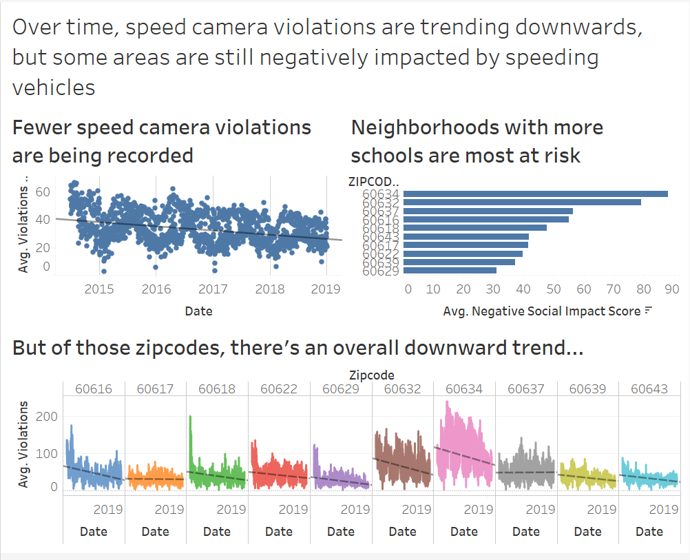

# Independent Project

link to Tableau Public: https://public.tableau.com/profile/hariz.hisham#!/vizhome/seond_checkpoint/Dashboard1

## 1. Collecting the data

To replicate these visualizations, you will first need to download the datasets. Click on the links below:

* [Ward data](https://data.cityofchicago.org/Facilities-Geographic-Boundaries/Ward-Offices/htai-wnw4/data)
* [Speed camera violation data](https://data.cityofchicago.org/Transportation/Speed-Camera-Violations/hhkd-xvj4/data)
* [Chicago public school locations data](https://data.cityofchicago.org/Education/Chicago-Public-Schools-School-Locations-SY1819/8vyn-k2j3)

Once you've clicked on these links, click on the export button and save each file as a .csv file.

## 2. Consolidating data

Time to fire up Tableau Desktop. Be sure to have the most recent version of Tableau installed on your machine. I created these visualizations using Tableau Desktop v2019.3.

Start with Speed Camera Violations dataset. Load the speed camera violations into Tableau. Next, drag and drop the ward offices dataset into the same space. when prompted, join the two tables using an 'Inner Join', with Wards = Ward. 

Next, drag the school location dataset and do the same thing. However, this time use a 'Left Join' with Zipcode = ZIPCODE instead.

Now, we're ready to visualize.

## 3. Visualize data

The first chart uses only two attributes - average violations per camera and date. Since the chart uses only two attributes, it is a fairly simple chart to digest. Since there is no differentiating factor between each data point, a consistent color throughout the chart makes it easy to read. 

The title of the chart says what the chart is intending to show - that there is an overall downward trend for violation recordings. However, having only the scatterplot points would not have easily shown the downward trend, overlaying Tableau's trend line helps to visualize the decrease over time. Additionally, using vertical gridlines have helped to differentiate onto which time segments the scatterplot falls. 

This chart gives the reader a good overview of the current state of speed camera violations in the city of Chicago relative to how it was 4 years ago. It is likely that the city's new traffic inititive "Vision Zero" has resulted in more speed cameras being installed around schools and parks [1]. Given this information, the downward trend is quite expected, as more speed cameras being installed might mean a lower proportion of cameras capturing speed violations, or that drivers behavior have changed due to knowing more speed cameras are installed.

For the second visualization, an attempt to quantify speed camera violations per neighborhood was made. The rationale behind this was to see where most speed camera violations were concentrated. However, a visualization with only zipcode and average violations would not have been particularly useful - after all, what is a zipcode but a way to divide a city?

This is where the ward and school location datasets came useful. The ward dataset was used to bridge the speed camera violations dataset with the school location dataset. Then, the number of schools for each zipcode were calculated. Next, the following formula was used to calculate what we will call the "Negative Social Impact" (NSI) score:

No. of violations * log(No. of schools)

The rationale behind this formula is that zipcodes with more schools AND higher numbers of speed camera violations would be punished by the score, since it is a safety hazard to people within that zipcode.

Given that, the bar chart produced is rather simple in design. We end up with a chart with only two attributes, and some high-school level math under the hood. The y-axis is ordered according to which zipcode has the highest NSI score, making it easy for the reader to pick out which zipcodes to focus on. The x-axis shows the average NSI score for those zipcodes, so there might be some bias to zipcodes that have abnormally large spikes in violations, but taking the sum or count would not have made any more sense.

The caption below the visualization helps the reader understand the math going on behind the scenes. The interpretation however, can be debated since there are many other ways to manipulate the math to punish areas with more schools and more violations.

This chart gives a good snapshot and interpretation on how speed violations might negatively affect neighborhoods with a high concentration of schools. More school zones mean that more children are exposed to traffic safety hazards. This hazard is further compounded if those schools are within close proximity of roads where drivers tend to drive above the speed limit. As such, a program like that mentioned in [1] would help deter drivers from driving dangerously.

For the final visualization, it would be useful to see how each of these Zipcodes are performing in terms of speed camera violations over time. To do this, the visualization splits up each Zipcode into its own column and color, with average violations plotted over time from 2014 to 2018. Then, a trend line is added to each of the ten plots. What's produced is a comparison of violation trends across the top 10 Zipcodes with highest violations.

On the y-axis is the average violations, while the x-axis is the date-time. Each Zipcode has its own color to help with identification and draw the reader's attention so that each chart is salient in the reader's mind. The legend was left there so that it can be used again with other charts (if needed) when combined on a dashbaord.

However, this produces a very cluttered chart. It would have probably been better to include all ten Zipcodes as individual lines on a single unified chart. We would do away with individual trend lines, but it would produce a much cleaner chart. 

This chart would be useful in pinponting Zipcodes with high levels of speed camera violations that might be underperforming similar Zipcodes. For example, in the above chart, we see all but two Zipcodes (60637 & 60617), experience a downard trend over time. It would be beneficial for the city to investigate why these areas are not improving over the last 4 years, and potentially invest more resources to curb speed camera violations. Remember, these are speed cameras installed close to school areas [2], so improving safety must be top priority!

## 4. Dashboarding

Finally, we bring all of the visualizations together using Tableau's Dashboard function. The resulting dashboard is not great, but it is not the worst either. It has a clean look with white backgrounds and even segmentation. However, as pointed out above, the bottom chart makes the dashboard look cluttered. This could have been improved by using a simple line chart instead.

This dashboard could potentially be used by the City of Chicago as a high-level snapshot into the state of speed camera violations in 'hotspots' around the city. It aims to tell the story that it is true the City is improving in curbing speed camera violations overall, but they need to now focus on Zipcodes with high numbers of schools still experiencing high levels of drivers speeding, in order to increase pedestrian safety. This could be used by the Mayor of Chicago as a potential talking point in the next Mayor election, either to affirm their work over the last 4 years, or used by a newcomer to refute an incumbent Mayor for not putting in enough effort. The coin can be flipped both ways.

## References

[1] Wisniewski, Mary. "City will add speed cameras near 3 schools, 2 parks this summer." Chicago Tribue. 3 July 2018. https://www.chicagotribune.com/news/ct-biz-speed-cameras-20180703-story.html

[2] Portal, Chicago Data. "Speed Camera Violations" Chicago Data Portal. 29 April 2018. https://data.cityofchicago.org/Transportation/Speed-Camera-Violations/hhkd-xvj4
